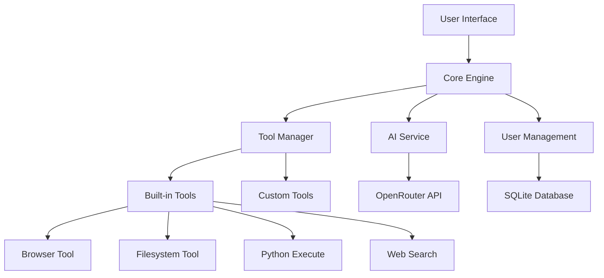

# Introduction to Operon.one

Welcome to **Operon.one**, the next-generation Action-AI that transforms how you interact with technology. Unlike traditional AI assistants that only provide information, Operon.one takes action on your behalf across multiple platforms and services.

## What is Operon.one?

Operon.one is a powerful AI agent platform that combines:

- **🤖 Advanced AI Capabilities**: Powered by state-of-the-art language models
- **🔧 Extensive Tool Integration**: Pre-built tools for common tasks
- **🌐 Multi-Platform Support**: Works across web, desktop, and server environments
- **🚀 MCP Compatibility**: Full support for Model Context Protocol
- **🛡️ Enterprise Features**: User management, security, and administration

## Core Features

### Action-Oriented AI

Operon.one doesn't just answer questions—it performs actions:

- Browse the web and extract information
- Execute code in multiple programming languages
- Manage files and directories
- Send emails and notifications
- Generate images and content
- Interact with APIs and services

### Modular Tool System

The platform is built around a flexible tool architecture:

- **Pre-built Tools**: Ready-to-use tools for common tasks
- **Custom Tools**: Easy-to-create custom integrations
- **Tool Chaining**: Combine multiple tools for complex workflows
- **Dynamic Loading**: Tools are loaded on-demand for efficiency

### User-Friendly Interface

- **Web Dashboard**: Modern, responsive web interface
- **Real-time Communication**: WebSocket-based real-time interactions
- **Admin Panel**: Comprehensive administration and monitoring
- **Mobile Support**: Optimized for mobile and tablet devices

## Architecture Overview

## Use Cases

### 🎯 Personal Productivity

- Automate research tasks
- Generate and organize content
- Manage files and documents
- Schedule and coordinate activities

### 💼 Business Operations

- Customer support automation
- Data analysis and reporting
- Content creation and marketing
- Process automation

### 🔬 Development & Research

- Code generation and debugging
- API testing and integration
- Data collection and analysis
- Documentation generation

### 🎓 Education & Learning

- Research assistance
- Content creation
- Learning material generation
- Study aid automation

## Getting Started

Ready to dive in? Here's what you need to know:

1. **[Quick Start](/guide/getting-started)**: Get up and running in minutes
2. **[Docker Setup](/guide/docker-setup)**: Deploy with Docker (recommended)
3. **[Development Setup](/guide/development)**: Set up for development
4. **[Configuration](/guide/configuration/environment)**: Configure your instance

## Next Steps

- Explore the [available tools](/tools/)
- Check out the [API documentation](/api/)
- Learn about [creating custom tools](/tools/development/creating-tools)
- Join the community on [GitHub](https://github.com/neooriginal/Operon.one)
